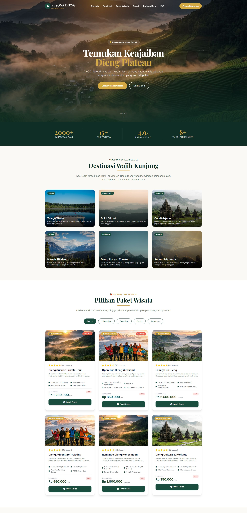
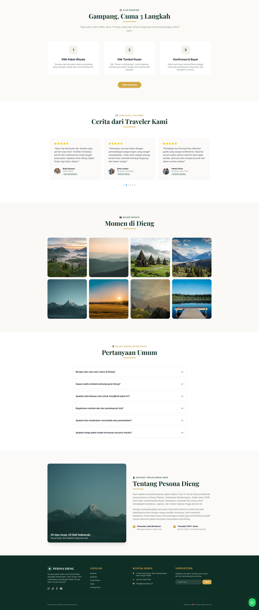

# Pesona Dieng | Platform Pemesanan Paket Wisata

Platform web modern berbasis **Laravel** untuk menjelajahi, merencanakan, dan memesan paket wisata ke Dataran Tinggi Dieng Plateau, Kabupaten Banjarnegara, Jawa Tengah secara mudah, cepat, dan dinamis.

---

## 📸 Tampilan Aplikasi

Berikut adalah tangkapan layar dari antarmuka platform Pesona Dieng:

### 1. Halaman Utama (Landing Page)


### 2. Halaman Detail & Form Pemesanan Interaktif


---

## ✨ Fitur Utama

- **Daftar Paket Wisata Dinamis**: Paket wisata dimuat langsung dari `PackageController`, menyajikan detail deskripsi, galeri, fasilitas, dan rating terkini.
- **Duration Switcher**: Pengguna dapat mengubah durasi trip (misal: 2 Hari 1 Malam vs 3 Hari 2 Malam) secara instan. Itinerary, fasilitas, harga dasar, dan persentase diskon akan ter-update secara otomatis di sisi klien tanpa *page reload*.
- **Pemilihan Tanggal & Jumlah Peserta**: Dilengkapi input kalender tanggal keberangkatan (dengan pembatas minimal otomatis ke hari ini) serta kontrol jumlah kuantitas peserta/keluarga/pasangan.
- **Kalkulasi Biaya Otomatis**: Estimasi total biaya dihitung secara instan (`harga unit * jumlah peserta`) saat kuantitas atau durasi dipilih.
- **Form WhatsApp Booking Instan**: Tombol pemesanan WhatsApp otomatis merangkum detail pilihan pengguna (Nama Paket, Durasi, Tanggal, Jumlah Peserta, Unit Price, dan Total Biaya) ke dalam draf pesan terformat rapi untuk dikirimkan ke admin.
- **Desain Premium & Responsif**: Tampilan modern menggunakan **Tailwind CSS**, tipografi Google Fonts (Playfair Display & Inter), ikon FontAwesome, efek *glassmorphism*, dan animasi interaktif yang ramah di perangkat *mobile*.

---

## 🛠️ Teknologi & Dependensi

- **Backend**: Laravel 10 (PHP >= 8.1)
- **Frontend**: Blade Templating Engine, Tailwind CSS (CDN), Vanilla JavaScript
- **Ikon & Font**: FontAwesome v6, Google Fonts (Cormorant Garamond, Inter, Playfair Display)

---

## 🚀 Panduan Instalasi Lokal

Ikuti langkah-langkah berikut untuk menjalankan aplikasi di komputer Anda:

### 1. Clone Repositori
```bash
git clone https://github.com/diskonnekted/pesona-dieng.git
cd pesona-dieng
```

### 2. Instal Dependensi Composer
```bash
composer install
```

### 3. Konfigurasi Environment File
Salin file `.env.example` menjadi `.env`:
```bash
cp .env.example .env
```
Buka file `.env` baru Anda dan sesuaikan variabel konfigurasi (seperti nomor WhatsApp admin):
```env
WHATSAPP_NUMBER=6281234567890
```

### 4. Generate Application Key
```bash
php artisan key:generate
```

### 5. Jalankan Server Pengembangan
Aplikasi dikonfigurasi menggunakan port **8081**:
```bash
php artisan serve --port=8081
```

Akses aplikasi melalui browser Anda di: [http://127.0.0.1:8081/](http://127.0.0.1:8081/)
